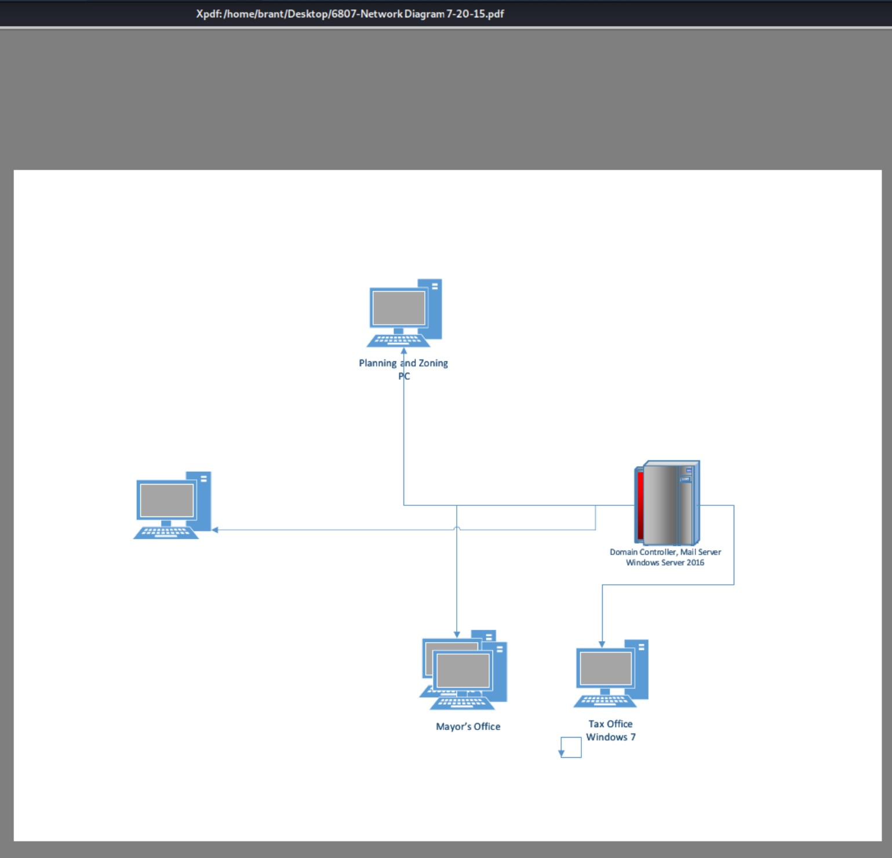

# Disk Analysis

Brant Goings - CYBER 440

All disks analyzed using Autopsy 4.14.0

### IT_2

#### Emails

Lots. Exported as .csv and parsed with Python

#### Recent Documents

These network diagrams show how the company has grown over the years. The interesting part is the most recent diagram, 12-10-19, was deleted for an unknown reason.

*6807-Network Diagram 7-20-2015.pdf*

*6805-Network Diagram 4-15-2017.pdf*

*6803-Network Diagram 12-10-2019.pdf*

Below are the most current devices on the network.

*Network Table.docx*

*Network Table.xlsx*

#### Users

- admin
- Administrator
- DouglasAdams
  - MRCv120.exe in Desktop
- RoyTremmeman
  - NetworkMiner, MRCv120, all Network diagrams, Wireshark

#### Interesting Programs

- NetworkMiner: Similar to Wireshark, but more likened to tcpdump
- MRCv120: Live M/W scanner? No installation?

### Next Machine
