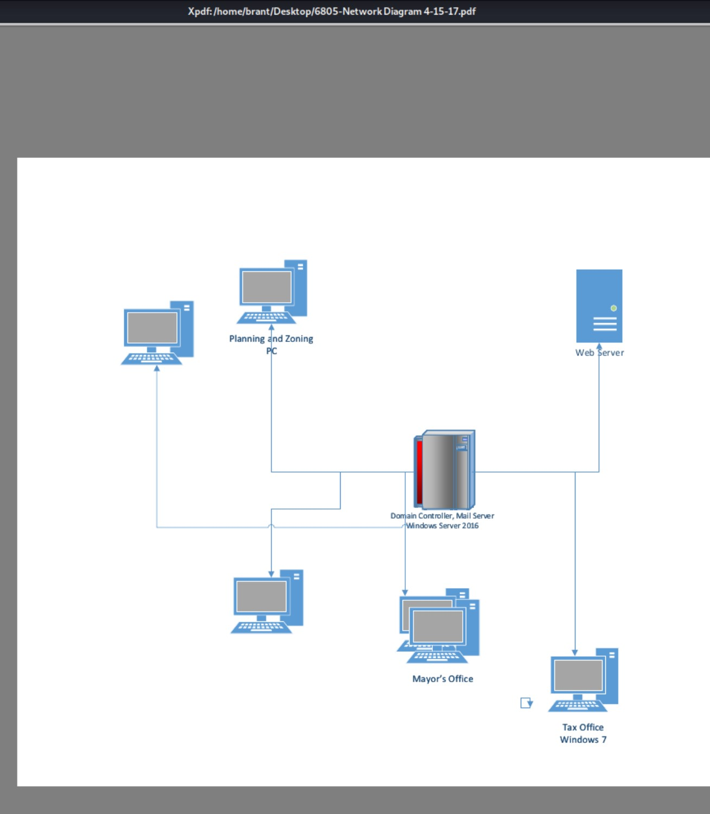
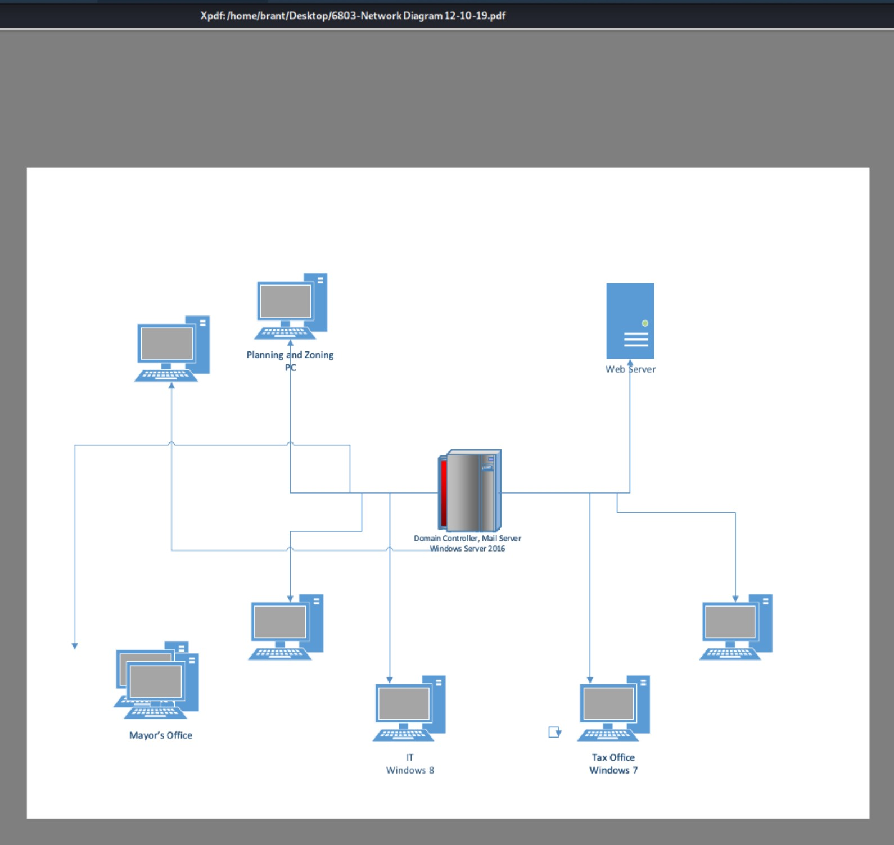
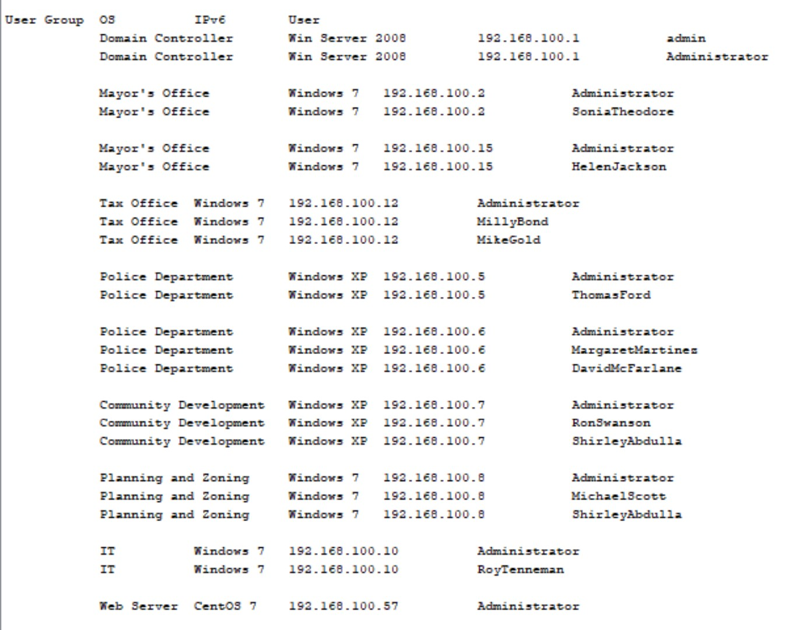

# Disk Analysis

Disks analyzed using Autopsy 4.14.0

### IT_2

IP Address:

#### Users

- admin
- Administrator
- DouglasAdams
  - MRCv120.exe in Desktop
- RoyTremmeman
  - NetworkMiner, MRCv120, all Network diagrams, Wireshark

#### Emails

Lots. Exported as .csv and parsed with Python

#### Recent Documents

These network diagrams show how the company has grown over the years. The interesting part is the most recent diagram, 12-10-19, was deleted for an unknown reason.

*6807-Network Diagram 7-20-2015.pdf*

*6805-Network Diagram 4-15-2017.pdf*

*6803-Network Diagram 12-10-2019.pdf*

Below are the most current devices on the network.

*Network Table.docx*

*Network Table.xlsx*

#### Interesting Programs

- NetworkMiner: Similar to Wireshark, but more likened to tcpdump
- MRCv120: Live M/W scanner? No installation?

### Mayor2_2

IP Address:

#### Users

- SoniaTheodore
- HelenJackson
- ShirleyAbdulla
- Administrator
- admin
- Guest

#### Emails

#### Recent Documents

Lots of "Board Meeting" PDFs

#### Interesting Programs

#### IOC
- HelenJackson's Desktop contains `RansomNote.txt` claiming system encryption and giving a bitcoin wallet number

### SharedDrive

IP Address:

#### Commentary

Personal data should not be kept on Shared Drives where it is accessible and possibly writeable by an arbitrary user.

The same goes for HIPAA, FERPA, and other sensitive data. In this case, that is tax and police records.

*Are the cat pictures encrypted files or actually cats?*

#### Data Contained

#### IOC
